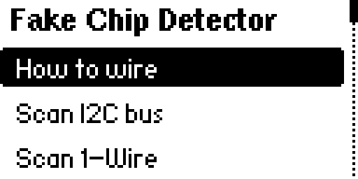
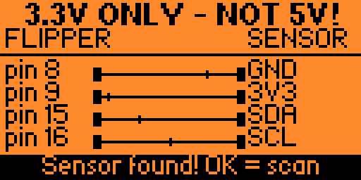
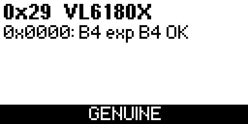
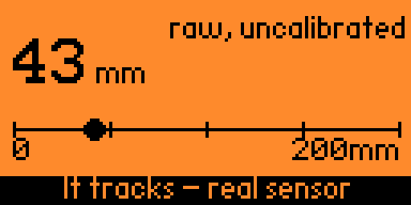
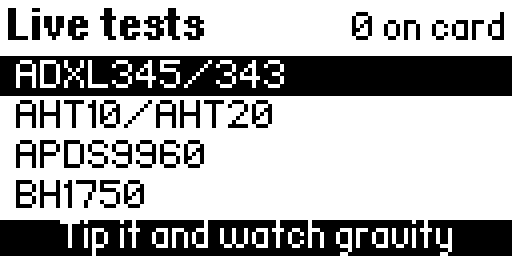
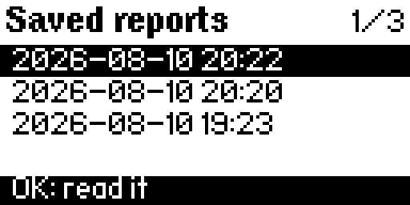
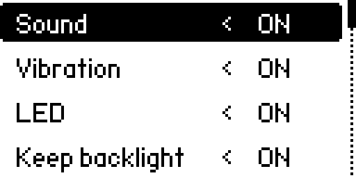
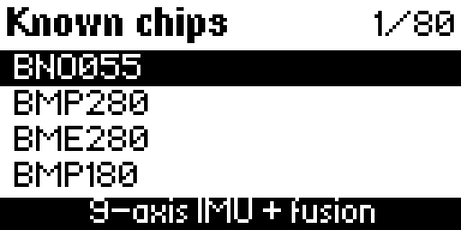

# Fake Chip Detector — a guide for people who are not electronics people

You bought a sensor online. It arrived. The board says one thing; nobody can tell you whether
the chip on it agrees, because the chip is a black square three millimetres wide with a laser
mark on top that means nothing.

This app asks the chip directly. Every serious sensor has a number burned into it at the
factory, in a place the chip returns when asked — not printed on the package, where anybody with
a laser can print whatever sells. This app reads that number and tells you which part you
actually have. It takes about five seconds and you can do it at the pickup counter, before you
pay.

You do not need to know anything about electronics to follow this. Every step below says exactly
which wire goes where and what should appear on the screen.

---

## 1. What you need

- **A Flipper Zero.** Any of them.
- **The app**, `fake_chip_detector.fap`, from
  [the latest release](https://github.com/hleserg/flipper-fake-chip-detector/releases/latest).
- **The sensor module** you want to check. This app is for **I²C** sensors — that means the
  board has pins labelled **SDA** and **SCL** somewhere on it. If it does, this app works with
  it. (There is a second mode for DS18B20 temperature probes; see step 9.)
- **Four jumper wires.** The kind with a socket on both ends — "female-to-female", "DuPont
  wires". They cost almost nothing and every module seller has them.

Nothing has to be soldered. That is the entire point: check it *before* the soldering iron
comes out.

## 2. Put the app on the Flipper

Either way works:

- **With qFlipper** (the desktop program from flipperzero.one): open it, plug in the Flipper,
  and drag `fake_chip_detector.fap` onto the file browser at `SD Card / apps / GPIO`.
- **With the SD card**: take the card out, put the file in the `apps/GPIO` folder, put it back.

Then on the Flipper: **Apps → GPIO → Fake Chip Detector**.

If the Flipper says *"App Too Old"* or something about an API version, the app was built for a
different firmware than yours. That is not something you can fix by re-downloading; see
[the README](README.md#install).

## 3. Connect four wires

Four wires, and **the order matters**. The pins are numbered along the top edge of the Flipper —
the numbers are printed on the case.

| Wire | Flipper pin | Sensor pin |
|---|---|---|
| 1st | **8** | **GND** |
| 2nd | **9** | **3V3** or **VCC** |
| 3rd | **15** | **SDA** |
| 4th | **16** | **SCL** |

**Ground first, signals last, every time.** Until the GND wire is in, electricity from the other
wires has to find its way back through parts of the chip that were never meant to carry it —
that is how a perfectly good module dies during a five-second test. When you take it apart,
reverse the order: signals, then power, then ground last.

**Two things that break sensors, both easy to avoid:**

- The Flipper's pins are **3.3 volts and cannot survive 5 volts.** Do not use pin 1 (that is the
  5 V pin) even if your module says "5V" on it. Almost every module runs happily on 3.3 V.
- **SDA is pin 15 and SCL is pin 16.** Several popular pinout pictures on the internet have
  these two swapped. If you copied one of those, the app will tell you (step 4).

## 4. Check the wiring before you scan

In the app, open **How to wire**. This screen watches the four connections live: each wire is
drawn broken and closes up when that connection actually works.

When all four are solid and it says **Sensor found**, press OK to scan. If it does not:

| What it says | What it means | What to do |
|---|---|---|
| *Waiting for sensor…* | nothing is answering | check the wires are in the right pins, and that the module is getting power |
| *No pull-ups on the bus* | the sensor has no power, or SDA/SCL are not connected | check pins 9, 15 and 16 |
| *Line stuck low* | one wire is touching ground, or the chip has hung | unplug, plug back in, in the right order |
| *SDA and SCL are shorted* | pins 15 and 16 are connected to each other | one wire is in the wrong hole |

The app also looks for your module on the *wrong* pins, which is the most common mistake of all:

## 5. Scan, and answer the one question

**Scan I2C bus** sweeps every address a sensor can live at and identifies whatever answers. If
one chip answered, you go straight to this:

The app has done its half: it knows the chip is a VL6180X, a laser rangefinder. It cannot do
your half, because it cannot see the box, the listing or the silkscreen. So it asks.

- Press **OK** if that is what you ordered.
- Press **DOWN** if it is not.

Say yes and you get the answer everybody wants:

Say no and the app writes it down as a dispute — the wording is aimed at a seller, not at you:

If several chips answered, you get a list instead; press OK on the one you care about.

## 6. What the words mean

| On screen | In plain language |
|---|---|
| **GENUINE** | Every identifying number matched a known chip. The silicon really is that part. Now compare it with what you were sold. |
| **LIKELY FAKE** | Some numbers matched and others did not. A real one gets them all right. |
| **UNIDENTIFIED** | Something is there, but it matches nothing the app knows. Usually a chip missing from the app's list rather than a fake — the raw numbers are shown so you can look them up. |
| **IT ANSWERS** / **DETECTED (no ID reg)** | The chip is there, but this kind of chip has no identifying number at all. Presence is all anybody can prove. This is where a live test (step 7) earns its keep. |
| **NO ANSWER** | Something acknowledged its address and then would not talk. |

The app will not tell you a part is real when all it knows is that something answered. That
restraint is the reason to trust it when it does say GENUINE.

Press **▸ (right)** on the good screen to see the actual evidence — the register it read, the
value it expected, and what it got:

## 7. Make it prove it works

An identifying number is one byte, and a byte can be copied. A working sensor cannot be. So when
a chip checks out and the app has a test for it, it offers one — press **OK**.

Every test is something you can do with your hands, standing up, in a few seconds:

| Sensor | What you do |
|---|---|
| AHT10/20, SHT30/31/40 | breathe on it |
| BH1750 | hold it to the light, then cover it with your hand |
| MPU6050/6500/9250, ADXL345 | lay it flat, then tip it on its side |
| APDS9960 | wave your hand over it |
| MLX90614 | point it at your palm |
| DS3231 | nothing at all — watch the seconds tick |
| SSD1306 display | watch the panel blink |
| BNO055 | turn it through a figure-8 |
| VL6180X | hold your hand in front of it |

The Flipper chimes and shows a tick the moment a test passes. **Live tests** in the main menu
lists every test and runs any of them without scanning first — useful when you already know what
the board is:

More about live tests, including how to add tests other people have written:
**[LIVE_TESTS.md](fake_chip_detector/LIVE_TESTS.md)**.

## 8. Keep the evidence

From the verdict screen, press **▲ (up)** to read the written report. It is deliberately written
so that somebody who has never heard of an I²C register can follow it: what the chip is, why a
factory number cannot be faked by a seller, and the raw values last.

To save it to the SD card, press **▼ (down)** — or **▸ (right)** if you are looking at a list of
several chips rather than a single verdict. (Before you have answered the "is this what you
bought?" question, ▼ still means *no*; saving only starts once you have answered.) Saved reports
land in `apps_data/fake_chip_detector/` as ordinary text files, and **Saved reports** in the menu
reads them back on the device:

That text file is the thing to attach to a refund request.

## 9. DS18B20 temperature probes

Those steel probes on a cable are not I²C — they speak a different protocol called 1-Wire, so
they get their own menu item, **Scan 1-Wire**. Wire the data line to **pin 17**, ground to pin 8,
power to pin 9.

The app reads the probe's serial number, says which part it really is — a DS18S20 sold as a
DS18B20 is caught here — and takes an actual temperature reading. Be aware that a 1-Wire serial
number can be imitated by any small microcontroller, so this proves *which part answered*, never
that the part is authentic. The app says so on screen rather than pretending otherwise.

## 10. Odds and ends

**Turn the noise off.** **Settings** switches the sound, the vibration and the LED independently.
The Flipper is loud in a quiet shop.

**Browse what it knows.** **Known chips** lists all 80 parts in the app's database with a line
about what each one does — handy when a listing gives you a part number and nothing else.

## What this app cannot do

It reads what the chip says about itself. It cannot see the packaging or the seller's listing, so
the comparison with what you *paid for* is always yours to make.

Some fakes cannot be caught this way at all, and the app says so instead of guessing:

- SHT30, SHT31 and SHT35 differ only in accuracy grade — electrically they are identical.
- "SSD1306" displays that are really SH1106 return no identifying byte over I²C.
- ADXL345 clones usually return the correct number and only give themselves away by drifting.

A GENUINE verdict is strong evidence you were not sold a relabelled part. It is not a promise
that the part is new, undamaged, or any good.

## Something went wrong, or a chip is missing

Write to [@skhlebnikov](https://t.me/skhlebnikov) on Telegram, or open an issue on
[GitHub](https://github.com/hleserg/flipper-fake-chip-detector/issues). A chip the app does not
know is a useful report, not a nuisance — the database grows from exactly those.
